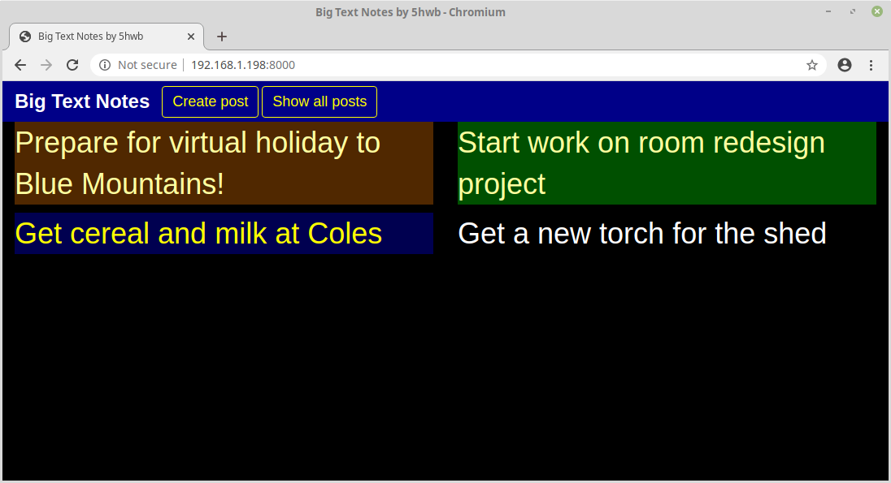
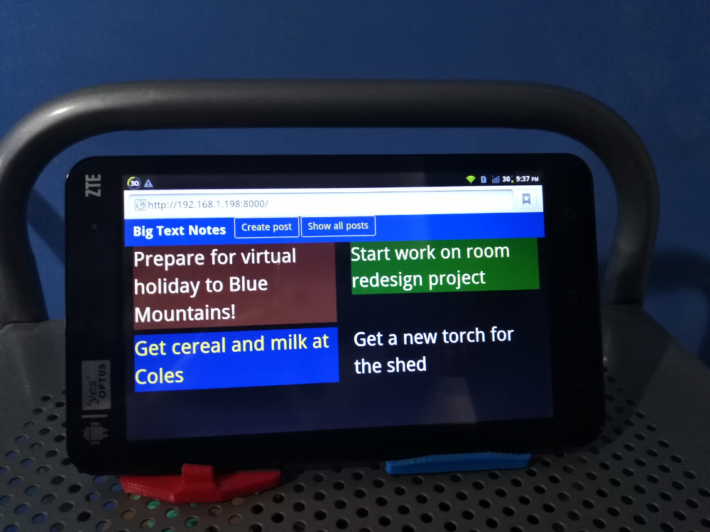
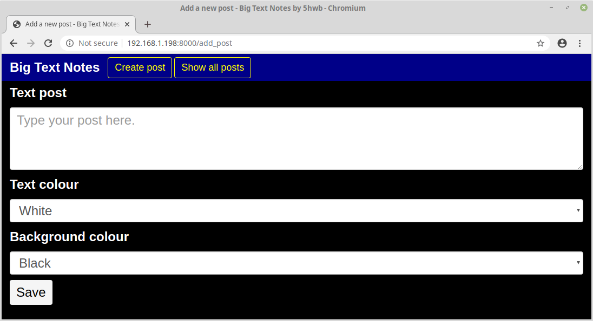
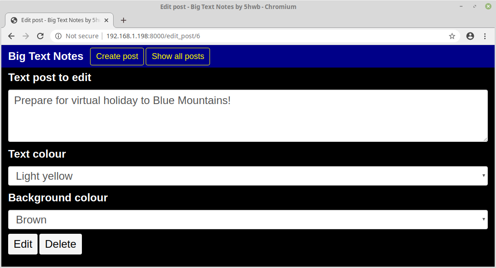
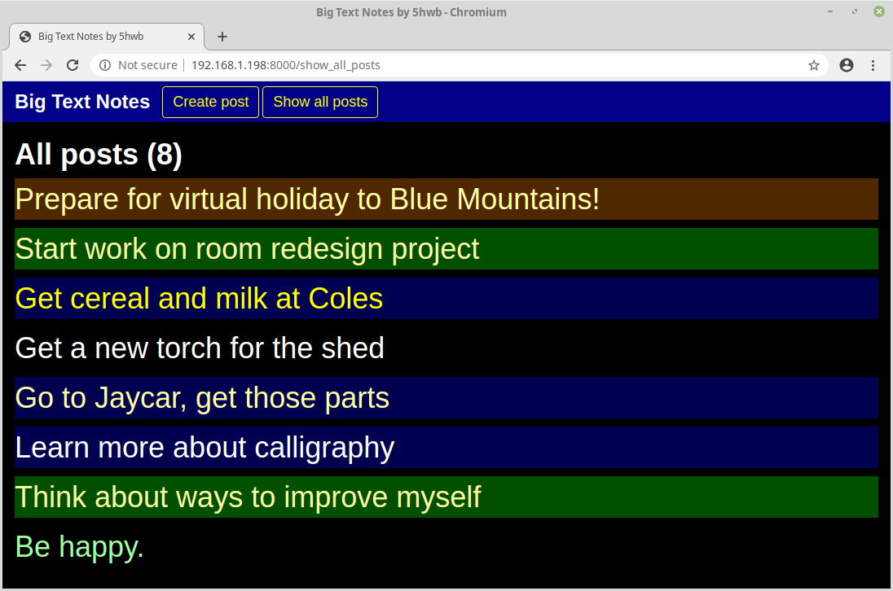

# Big Text Notes

A simple Django web application that displays notes in a large font. Each post has a text colour and background colour that can be customised individually.

The home page is configured to show four notes at a time, switching to the next four notes every 6 seconds.

## Applications for Big Text Notes

The original motivation for creating this app was to repurpose a 9-year-old tablet running Android 2.3 to be able to show personal notes in a household setting, turning it into a configurable information display that can also be accessed from my other devices.

## Setup process

The main prerequisite for Big Text Notes is the Django web development framework, which can be installed from a terminal with Python's pip package manager using the command `pip install Django==2.2`.

For development, open a terminal and run `python3 manage.py runserver` to start the Django app.

## Screenshots

Add new post:

Edit an existing post:

View all posts created:

